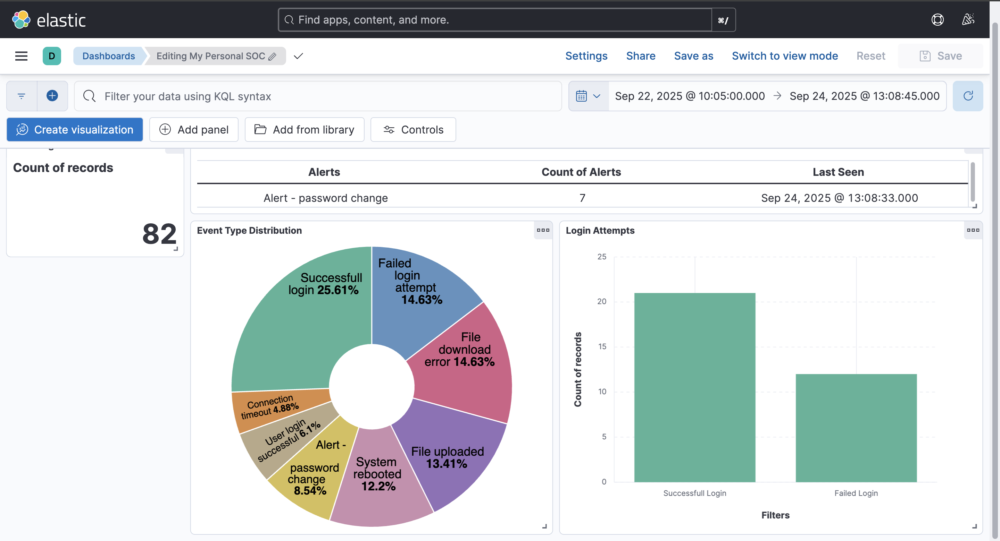

# Personal SOC Dashboard with the ELK Stack



## 📖 Overview

This project is a fully functional, containerized personal Security Operations Center (SOC) dashboard built using the ELK Stack (Elasticsearch, Logstash, Kibana) and Docker. It demonstrates a complete data pipeline: from generating synthetic security logs, to ingesting and parsing them, and finally visualizing the data on an interactive dashboard.

The goal is to monitor key security events, such as login attempts, file operations, and system alerts, providing a hands-on experience in data engineering and security analytics.

---

## ✨ Features

-   [cite_start]**Synthetic Log Generation**: A Python script (`synthetic_logs.py`) generates continuous, syslog-style security event logs.
-   [cite_start]**Containerized Deployment**: The entire ELK stack is orchestrated with Docker Compose for easy, one-command setup and teardown.
-   **Data Processing Pipeline**: Logstash ingests the logs and uses a Grok filter to parse the unstructured text into structured, queryable fields.
-   **Interactive Dashboard**: A Kibana dashboard provides at-a-glance visualizations for:
    -   Total event counts
    -   Event type distribution (logins, file errors, etc.)
    -   Successful vs. Failed login attempts
    -   A summary of recent critical alerts

---

## 🛠️ Tech Stack

-   **Data Storage & Indexing**: Elasticsearch 8.15.0
-   **Data Ingestion & Processing**: Logstash 8.15.0
-   **Data Visualization**: Kibana 8.15.0
-   **Containerization**: Docker & Docker Compose
-   **Log Generation**: Python 3

---

## 🚀 Getting Started

### Prerequisites

-   [Docker](https://www.docker.com/products/docker-desktop/) installed and running.
-   [Python 3](https://www.python.org/downloads/) installed.

### Installation & Setup

1.  **Clone the repository:**
    ```bash
    git clone [https://github.com/ethalkunal/personal-soc-dashboard.git](https://github.com/ethalkunal/personal-soc-dashboard.git)
    cd personal-soc-dashboard
    ```

2.  **Run the Log Generator:**
    Open a new terminal window and run the Python script. This will create `synthetic_logs.log` and start appending new logs to it every second.
    ```bash
    python3 synthetic_logs.py
    ```
    *Keep this terminal window running.*

3.  **Launch the ELK Stack:**
    In your original terminal, start the Docker containers.
    ```bash
    docker-compose up -d
    ```
    This will download the necessary images and start Elasticsearch, Logstash, and Kibana in the background. It may take a few minutes the first time.

4.  **Access Kibana:**
    Navigate to `http://localhost:5601` in your web browser. It may take a minute or two for Kibana to become fully available.

5.  **Import the Dashboard:**
    -   Click the menu icon in the top-left and go to **Stack Management -> Saved Objects**.
    -   Click **Import** in the top-right corner.
    -   Select the `kibana/export.ndjson` file from this repository.
    -   After the import is complete, navigate to **Dashboard** via the main menu and you will see the "My Personal SOC" dashboard ready to go!

---

## 🔧 Configuration Details

-   [cite_start]**`docker-compose.yml`**: Defines the three services (Elasticsearch, Logstash, Kibana), their networking, and volume mounts for data persistence and configuration.
-   **`logstash/pipeline/soc.conf`**: Configures the Logstash pipeline. It uses the `file` input to read `synthetic_logs.log`, the `grok` filter to parse the messages, and outputs to both Elasticsearch and the console for debugging.
-   [cite_start]**`synthetic_logs.py`**: A simple, standalone script that generates random syslog-formatted messages and writes them to `synthetic_logs.log`.
